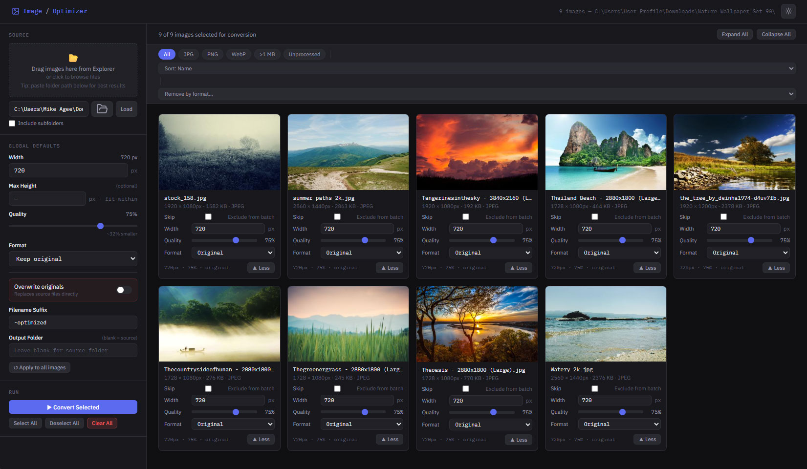

# Image Optimizer

A lightweight local web app for batch resizing, compressing, and converting images. Runs entirely on your machine — no cloud uploads, no sign-ups, no subscriptions.

Built with Python + Flask + Pillow. Works on Windows, macOS, and Linux.



---

## Features

- **Batch processing** — load a folder and convert all images in one click
- **Browse button** — native OS folder picker to select your image directory
- **Per-image overrides** — expand any image card to customize width, quality, and format individually
- **Global defaults** — set width, quality, format, and suffix once and apply to all
- **Format support** — output to WebP, JPG, PNG, or keep original format
- **Aspect ratio locked** — resizes by width, height scales proportionally (no cropping)
- **Output control** — custom filename suffix (e.g. `-optimized`, `-720`) and optional separate output folder
- **Overwrite mode** — toggle to replace source files directly instead of creating new ones
- **Skip toggle** — exclude individual images from a batch without removing them
- **Thumbnail previews** — each card shows a live preview of the source image
- **Results view** — after conversion, each card shows output file size and a color-coded status badge

---

## Project Structure

```
image-optimizer/
├── app.py               # Flask backend — scanning, path resolution, image processing
├── requirements.txt     # Python dependencies (Flask, Pillow)
├── start.bat            # Windows quick-launcher — installs deps and starts server
├── static/
│   ├── styles.css       # All UI styles
│   └── script.js        # All UI logic (vanilla JS, no build tools)
└── templates/
    └── index.html       # HTML structure only — links to static/
```

---

## Requirements

- **Python 3.8+**
- **pip** (bundled with Python 3.4+)
- A modern browser — Chrome or Edge recommended (required for the folder browse button)

---

## Installation

### 1. Get the code

```bash
git clone https://github.com/your-username/image-optimizer.git
cd image-optimizer
```

Or download and unzip the repository, then open a terminal in the project folder.

### 2. Install Python

#### Windows

Download from [python.org](https://www.python.org/downloads/). During install, check **"Add Python to PATH"**.

#### macOS

```bash
# Check if already installed
python3 --version

# Install via Homebrew if needed
brew install python
```

#### Linux (Debian/Ubuntu)

```bash
sudo apt update && sudo apt install python3 python3-pip
```

Verify after installing:

```bash
python3 --version   # macOS / Linux
python --version    # Windows
```

### 3. Install dependencies

```bash
pip install -r requirements.txt        # Windows
pip3 install -r requirements.txt       # macOS / Linux
```

### 4. Start the app

#### Windows (start.bat)

Double-click `start.bat`, or from a terminal:

```bat
start.bat
```

#### macOS / Linux

```bash
python3 app.py
```

Then open [http://localhost:5050](http://localhost:5050) in your browser.

To stop the server, press `Ctrl+C` in the terminal (or close it on Windows).

---

## How to Use

### Load images — four ways

#### Option A — Browse button (📁)

Click the folder icon next to the path field. A native OS folder picker opens. Select your folder and the app scans it automatically. If prompted, confirm or type the full folder path (a browser security limitation prevents automatic path detection).

#### Option B — Paste a folder path

Type or paste a full path into the field and click **Load** or press Enter.

- Windows: `C:\Users\you\Desktop\photos`
- macOS / Linux: `/Users/you/Desktop/photos`

#### Option C — Drag files from Explorer / Finder

Drag image files onto the drop zone. If the folder path field is already filled, paths are resolved automatically. If not, you'll be prompted to enter the folder path.

#### Option D — Click the drop zone

Opens a file picker to select individual images.

### Set global defaults (sidebar)
- **Width** — target pixel width; height scales automatically to preserve aspect ratio
- **Quality** — compression level (10–100); 75–85 is a good web default
- **Format** — keep original, or convert all to WebP / JPG / PNG
- **Overwrite originals** — when on, replaces source files directly (suffix field is ignored)
- **Filename Suffix** — appended before the extension (e.g. `hero-optimized.jpg`)
- **Output Folder** — leave blank to save next to originals; or specify a separate export folder
- Click **↺ Apply to all images** to push global settings to every card

### Per-image customization
- Click **▼ Edit** on any card to expand individual settings
- Each card has its own Width, Quality, Format, and Skip toggle
- The summary line below each card always reflects active settings
- Click **▲ Less** to collapse

### Run the batch
- Use **Select All / Deselect All** to manage the queue
- Click **▶ Convert Selected** to start
- A progress bar shows during processing
- Each card updates with a color-coded badge: green = success, red = error, grey = skipped
- The results bar at the bottom shows totals

---

## Output File Behavior

Given `hero.png` with suffix `-optimized` and WebP format:
```
Input:   hero.png
Output:  hero-optimized.webp
```

Given `team-photo.jpg` with suffix `-720` and JPG format:
```
Input:   team-photo.jpg
Output:  team-photo-720.jpg
```

With **Overwrite originals** enabled, the output replaces the source file at its original path.

---

## Extending This Project

This project is intentionally minimal and easy to extend. No build tools, no framework — just Python and vanilla JS.

### `app.py` — backend routes
- `/scan-folder` — scans a directory, returns image metadata (name, dimensions, size, format)
- `/resolve-files` — accepts uploaded file bytes, returns metadata; resolves real paths where possible
- `/resolve-paths` — given filenames + a folder path, returns full OS paths (used after drag-and-drop)
- `/preview` — serves a resized JPEG thumbnail of any local image for card previews
- `/convert` — accepts an array of job objects, processes each with Pillow, returns results
- `SUPPORTED_FORMATS` at the top of `app.py` — add extensions here to support more file types

### `static/script.js` — frontend state & logic
- `images[]` — array of image metadata from the server
- `overrides{}` — keyed by file path, stores per-image settings (width, quality, format, skip)
- `expanded{}` — keyed by file path, tracks which cards are open
- `renderGrid()` — re-renders the entire grid from state (call after any state change)
- `loadFolder()` — calls `/scan-folder`, populates state, renders grid

### `static/styles.css` — all UI styles

CSS custom properties (variables) are defined in `:root` at the top — easy to retheme.

### Ideas for future features
- Side-by-side before/after size comparison
- Subfolder recursion toggle
- ZIP download of all outputs
- Drag-and-drop reorder for processing priority
- Preset profiles (e.g. "Web Hero", "Thumbnail", "Full Quality Archive")

---

## Notes

- The app runs locally on port `5050`. Nothing is sent to any external server.
- To change the port, edit the last line of `app.py`: `app.run(port=5050)`
- The folder browse button requires Chrome or Edge (uses the `showDirectoryPicker` API)
- Supported input formats: JPG, PNG, WebP, GIF, BMP, TIFF
- PNG output ignores the quality slider (PNG is lossless); the optimize flag is still applied
- Images with transparency (RGBA) are automatically converted to RGB when saving as JPG or WebP
